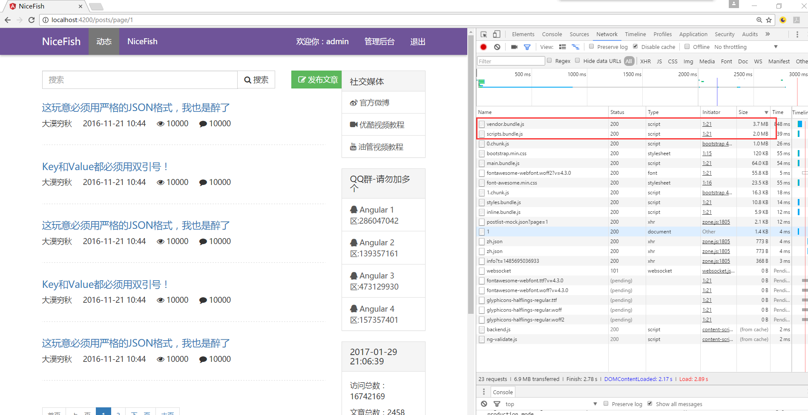
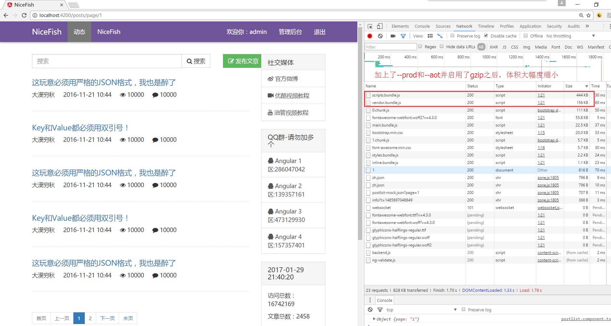

# MyBlog（我的博客）

MyBlog是一个基于大漠穷秋NiceFish项目开发的个人技术博客系列项目，使用MEAN-stack技术栈(MongoDB + Express + Angular4 + NodeJs)开发。

- 【MyBlog】：这是一个博客系统，前端基于Angular 4.0.0 + ng-Bootstrap。http://github.com/CN-Tower/MyBlog

- 【MyBlog-Admin】：这是MyBlog的系统管理界面，基于Angular 4.0.0。http://github.com/CN-Tower/MyBlogAdmin

- 【MyBlog-Ionic】：这是MyBlog的移动端，基于ionic。http://github.com/CN-Tower/MyBlogIonic

- 【MyBlog-BackEnd】：这是MyBlog的后台，基于NodeJS + Express + MongoDB。http://github.com/CN-Tower/MyBlogBackEnd

喜欢折腾，乐于分享！一起来玩吧，很好玩的哦 :-)

用git克隆本项目，从命令行进入进入项目根目录，依次执行以下命令：

	npm i -g cnpm
	cnpm i -g @angular/cli
	cnpm install
	ng serve

如果之前装过angular-cli需要先卸载：npm uninstall -g angular-cli
如果之前装过@angular/cli需要先卸载：npm uninstall -g @angular/cli
如果你之前已经尝试安装过node模块，请把MyBlog根目录下的node_moduels目录删掉
然后依次执行以下命令：

	npm cache clean
	npm i -g cnpm
	cnpm i -g @angular/cli
	cnpm install
	ng serve

打开你的浏览器，访问http://localhost:4200/

如果你想让加载的包更小，请使用以下方式启动angular-cli内置的轻量级http server

	ng serve --prod --aot

【注意】如果你发现ng serve起不来，或者起来有报错，请把MyBlog根目录下的node_modules目录删掉，然后重新执行cnpm install，全局的@angular/cli也需要重装。

## 更新

打开命令行，进入MyBlog根目录，依次执行以下命令：

	git pull
	cnpm update
	ng serve

噢对，如果你pull代码之后发现起不来了，请把你项目下的node_modules全部删掉，然后重新npm update。这里确实有点坑，但是我也不知道为什么。

## AOT&TreeShaking

开发状态打出来的bundle体积比较大，在发布到生产环境之前需要进行prod和AOT，用法如下：

打开命令行，进入MyBlog根目录，执行以下命令：
	
	ng build --prod --aot

加上--prod参数之后，angular-cli会自动启用TreeShaking（摇树）特性，简而言之，就是把用不到的包全部剔除掉，就像从树上把枯叶子摇下来一样，很形象吧？加上--aot参数是让angular-cli启动预编译特性。

angular-cli会在项目根目录下生成一个dist目录，里面就是编译、压缩好的文件了。仔细观察你会发现，这些文件的体积已经被大幅度压缩，加上gzip之后有一些文件只剩下1/4左右的大小。

【请注意】最新版本的angular-cli已经内置了对AOT和TreeShaking的支持，只要像上面这样在build的时候加上--prod和--aot参数就可以了，不需要再做任何其它任何配置工作，官方网站上的那一篇指南有点过时了。

## 注意（请仔细看）

如果你用原生的npm进行安装，可能需要采用科学的上网方式才能安装某些包！

所以强烈推荐采用cnpm来安装！

## 开源许可证
 MIT
